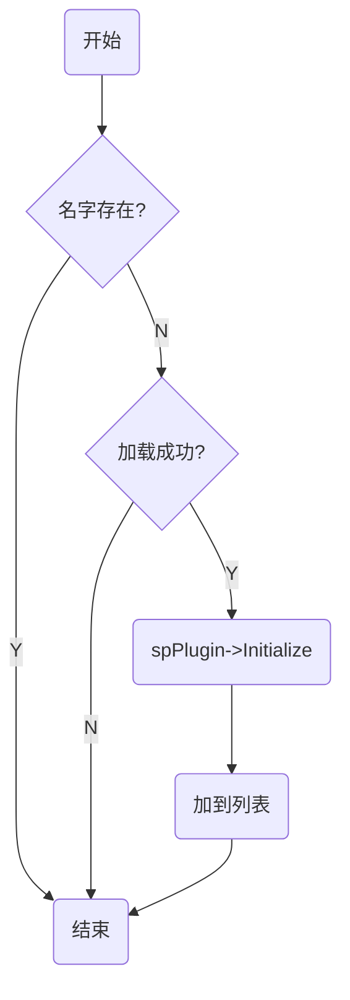

# CreateAsynFramePlugin函数  

通过实例管理器InstancesManager::Verify接口加载插件，同时设定该插件实例的插件名字  

# 语法  
```c++  
HRESULT __stdcall CreateAsynFramePlugin( /*[out]*/IAsynFramePlugin** object )  
```  

# 参数  
*[out]object*  
返回对象指针

# 返回值  
S_OK表创建插件成功，其他值表示失败  

# 备注
InstancesManager::Verify接口实现流程  


# CreateCommand函数  
  调用实例管理器InstancesManager::NewInstance接口创建IOsCommand对象  

# 语法  
```c++  
HRESULT __stdcall CreateCommand(/*[in ]*/InstancesManager* lpInstancesManager,  
      /*[in ]*/IUnknown** ppParam1,  
      /*[in ]*/uint64_t param2,  
      /*[out]*/IOsCommand** object)  
```  

# 参数  
*[in ]lpInstancesManager*  
实例管理器，禁止lpInstancesManager=NULL  
*[in ]ppParam1*  
*[in ]param2*  
*[out]object*  
返回对象指针

# 返回值  
S_OK表创建对象成功，其他值表示失败  

# 备注  
```c++
CComPtr<IOsCommand> object;
asynsdk::CStringSetter Soname(1, name);
IUnknown *params[2];
params[0] =&Soname;
params[1] = ppParam1[0];
params[2] = ppParam1[1];
lpInstancesManager->NewInstance(params, param2, IID_IOsCommand, (void **)&object.p);
```

# CreateDataTransmit函数  
  调用实例管理器InstancesManager::NewInstance接口创建IDataTransmit对象  

# 语法  
```c++  
HRESULT __stdcall CreateDataTransmit(/*[in ]*/InstancesManager* lpInstancesManager,  
      /*[in ]*/IUnknown** ppParam1,  
      /*[in ]*/uint64_t param2,  
      /*[out]*/IDataTransmit** object)  
```  

# 参数  
*[in ]lpInstancesManager*  
实例管理器，禁止lpInstancesManager=NULL  
*[in ]ppParam1*  
*[in ]param2*  
*[out]object*  
返回对象指针

# 返回值  
S_OK表创建对象成功，其他值表示失败  

# 备注  
```c++
CComPtr<IDataTransmit> object;
asynsdk::CStringSetter Soname(1, name);
IUnknown *params[2];
params[0] =&Soname;
params[1] = ppParam1[0];
params[2] = ppParam1[1];
lpInstancesManager->NewInstance(params, param2, IID_IDataTransmit, (void **)&object.p);
```

# CreateAsynPtlSocket函数  
调用网络模块IAsynNetwork::CreateAsynPtlSocket接口创建Socket对象  

# 语法  
```c++  
HRESULT __stdcall CreateAsynPtlSocket(/*[in ]*/InstancesManager* lpInstancesManager,  
      /*[in ]*/IUnknown** ppParam1,  
      /*[in ]*/const char* param2,  
      /*[in ]*/IAsynRawSocket** object )  
```  
# 参数  
*[in ]lpInstancesManager*  
实例管理器，禁止lpInstancesManager=NULL  
*[in ]ppParam1*  
*[in ]param2*  
*[out]object*  
返回对象指针

# 返回值  
S_OK表创建插件成功，其他值表示失败  

# CreateAsynDnsResolver函数  
调用网络模块IAsynNetwork::CreateAsynDnsResolver接口创建IAsynDnsResolver对象  

# 语法  
```c++  
HRESULT __stdcall CreateAsynDnsResolver(/*[in ]*/InstancesManager* lpInstancesManager,  
      /*[in ]*/IUnknown** ppParam1,  
      /*[in ]*/const char* param2,  
      /*[in ]*/IAsynMessageEvents* events,  
      /*[out]*/IAsynDnsResolver** object )  
```  
# 参数  
*[in ]lpInstancesManager*  
实例管理器，禁止lpInstancesManager=NULL  
*[in ]ppParam1*  
*[in ]param2*  
*[in ]events*  
*[out]object*  

# 返回值  
S_OK表创建对象成功，其他值表示失败  

# CreateAppService函数  
调用网络模块IAsynNetwork::CreateAppService接口创建IAppService对象  

# 语法  
```c++  
HRESULT __stdcall CreateAppService(/*[in ]*/InstancesManager* lpInstancesManager,  
      /*[in ]*/IUnknown** ppParam1,  
      /*[in ]*/const char* param2,  
      /*[in ]*/IAsynMessageEvents* events,  
      /*[out]*/IAppService** object )  
```  
# 参数  
*[in ]lpInstancesManager*  
实例管理器，禁止lpInstancesManager=NULL  
*[in ]ppParam1*  
*[in ]param2*  
*[in ]events*  
*[out]object* 

# 返回值  
S_OK表创建对象成功，其他值表示失败  